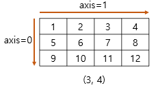
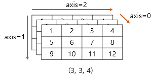

## AI Math & Python Basices for AI
<br>

## 1. Python

### 1.1 Numpy

0. NumPy 참고 사이트
    - [NumPy](https://numpy.org/doc/stable/reference/routines.array-creation.html)
1. import
    ```python
    import numpy as np
    ```
2. array 생성
    ```python
    arr = np.array([1, 2, 3, 4])
    f_arr = np.array([1, 2, 3, 4], float)
    ```
3. array shape
    ```python
    [1, 2, 3, 4] # (4,)
    ```
    ```python
    [ # (3, 4)
        [1, 2, 3, 4], 
        [4, 5, 6, 7], 
        [7, 8, 9, 0]
    ]
    ```
    ```python
    [ # (3, 3, 4)
        [
            [1, 2, 3, 4], 
            [4, 5, 6, 7], 
            [7, 8, 9, 0]
        ], 
        [
            [1, 2, 3, 4], 
            [4, 5, 6, 7], 
            [7, 8, 9, 0]
        ], 
        [
            [1, 2, 3, 4], 
            [4, 5, 6, 7], 
            [7, 8, 9, 0]
        ]
    ]
    ```
4. dtype
    - 각 원소들의 자료형
    ```python
    np.array([1.2, 2, 3], ['4', 5.5, 6.0], dtype=int)
    # [[1, 2, 3], [4, 5, 6]]
    ```

5. nbytes
    - ndarray의 메모리 크기 반환
    ```python
    np.array([1, 2, 3], dtype=np.int8).nbytes
    # 3bytes
    ```
6. reshape
    - array의 shape 변경
    ```python
    arr = np.array([[1, 2, 3], [4, 5, 6]])
    np.array(arr).reshape(6,)
    # [1, 2, 3, 4, 5, 6]
    ```
7. flatten
    - array를 1차원으로 펴줌
    ```python
    arr = np.array([[1, 2, 3], [4, 5, 6]])
    np.array(arr).flatten()
    # [1, 2, 3, 4, 5, 6]
    ```
8. indexing
    - 2차원 배열에서 [x, y] 형식으로 원소 접근 가능한 방법이다.
    ```python
    arr = np.array([[1, 2, 3], [4, 5, 6]])
    arr[0, 0] = 7
    ```
9. slicing
    - arr[row,column]
    ```python
    arr = np.array([[1, 2, 3], [4, 5, 6]])
    print(arr[:,:]) # 전체
    print(arr[:1,:2]) # [1, 2]
10. arrange
    - 지정 범위만큼 리스트 생성
    ```python
    np.arrange(5)
    # [1, 2, 3, 4, 5]
    np.arrange(0, 5, 0.5)
    # [0., 0.5, 1., 1.5 ... ]
    ```
11. zeros, ones, empty
    - ```zeros``` : 0으로 채워진 ndarray 생성
    - ```ones``` : 1로 채워진 ndarray 생성
    - ```empty``` : shape만 지정된 ndarray 생성
12. something_like
    1. ```ones_like```
        - ndarray를 shape 크기만큼 1로 채워 반환
        ```python
        np.ones_like(arr)
        ```
    2. ```zeros_like```
        - ndarray를 shape 크기만큼 0으로 채워 반환
        ```python
        np.zeros_like(arr)
        ```
13. identity
- 단위 행렬 생성
    ```python
    np.identity(n=3) # n : 행의 개수
    # 1 0 0
    # 0 1 0
    # 0 0 1
    ```
14. eye
- 대각선이 1인 행렬 생성. k값에 따라 시작 인덱스를 변경할 수 있다.
    ```python
    np.eye(N=3, M=5, k=2) # N:행, M:열, k:시작 인덱스
    # 0 0 1 0 0
    # 0 0 0 1 0
    # 0 0 0 0 1
    ```
15. diag
    - 대각 행렬 값 추출
    ```python
    np.diag(matrix)
    ```
16. random sampling
    - 데이터 분포에 따라 샘플링
    1. 균등분포
        ```python
        np.random.uniform(0, 1, 12).reshape(3, 4)
        ````
    2. 정규분포
        ```python
        np.random.normal(0, 1, 12).reshape(3, 4)
        ```
17. operation
    1. sum
    2. axis
        - 기준이 되는 ```dimension``` 축
            - 2차원
                - 
            - 3차원
                - 
            ```python
            arr.sum(axis=0)
            ```
    3. mean & std
        - ```mean```
            - element들의 평균 계산
        - ```std```
            - element들의 표준 편차 계산
        ```python
        arr.mean(axis=0)
        arr.std(axis=0)
        ```
18. concatenate
    - ndarray를 이어붙인다.
        1. ```vstack```
            - 행끼리 이어붙인다.
        2. ```hstack```
            - 열끼리 이어붙인다.
        ```python
        a = np.array([1, 2, 3])
        b = np.array([4, 5, 6])
        np.vstack((a, b)) # [[1, 2, 3], [4, 5, 6]]
        np.hstack((a, b)) # [1, 2, 3, 4, 5, 6]
        ```
        3. concatenate
            - 직접 ```axis```를 지정하여 붙일 수 있다.
            ```python
            a = np.array([1, 2, 3])
            b = np.array([4, 5, 6])
            np.concatenate((a, b), axis=0)
19. dot
    - 행렬의 곱셈
    ```python
    a.dot(b)
    ```
20. transpose
    - 행렬의 전치
    ```python
    a.transpose()
    a.T
    ```
21. broadcasting
    - ```shape```가 다른 배열 사이에 연산을 지원
    - 작은 사이즈를 큰 사이즈로 broadcast하여 연산
22. comparisons
    1. all
        - 논리 연산 ```AND```와 같음
        ```python
        np.any(a>5) # True or False
        ```
    2. any
        - 논리 연산 ```OR```와 같음
        ```python
        np.all(a>5) # True or False
        ```
    3. array 크기가 동일할 때 array끼리 ```comparison``` 연산을 할 수 있다.
        - 이 경우 각 element별로 비교 결과를 반환한다.
        ```python
        a > b
        a == b
        ```
23. where
    - 조건을 주고, 조건에 따라 값 부여하기
        ```python
        np.where(condition, True일 때 값, False일 때 값)
        ```
    - 인덱스 값 반환하기
        ```python
        np.where(a>5)
        ```

<br>

## 2. AI Math

### 2.1 Statistics
<hr>

- ```maximum likelihood estimation```
    - ```likelihood function```
        - 현재 데이터가 특정 분포로부터 나왔을 가능도이다.
        - 가능도를 계산하기 위해서는 likelihood 기여도(분포에 대한 높이)를 계산해서 모두 곱한 것이다.
        - 이를 수식으로 나타낸 likelihood function은 아래와 같다.
            - $P\left( x\middle| \theta \right) =\prod ^{n}_{k=1}P\left( x_{k}| \theta \right)$
        - log-likelihood function은 아래와 같다.
            - $L(\theta|x)=logP\left( x\middle| \theta \right) =\sum ^{n}_{i=1}logP\left( x_{i}\middle| \theta \right)$
        - ```maximum likelihood estimation```
            - 즉, 최대 가능도 함수는 ```likelihood function```의 최대값을 찾는 방법이다.
            - 이를 위해 $L(\theta|x)$를 $\theta$에 대해 편미분한 값이 0이 되는 $\theta$를 찾는다. 
                - $\begin{aligned}\dfrac{\partial }{\partial \theta }L\left( \theta \middle| x\right) =\dfrac{\partial }{\partial \theta }\log P\left( x\middle| \theta \right) \\ =\sum ^{n}_{i=1}\dfrac{\partial }{\partial \theta }logP\left( x_{i}\middle| \theta \right) =0\end{aligned}$
            - 따라서 최대가능도 추정법은 가장 높은 가능성을 가지는 모수를 추정하는 방법이다.
- 확률분포의 거리
    1. ```Total Variation Distance```
    2. ```Kullback-Leibler Divergence```
        - 쿨백-라이블러 발산은 두 확률분포 $p(y)$, $q(y)$의 분포모양의 차이를 숫자로 나타낸 것이다.
        - 쿨백-라이블러 발산이 0이면 두 확률분포는 같은 확률분포이다.
    3. ```Wasserstein Distance```

### 2.2 Convolution Neural Network
- 커널
    - 커널은 고정된 가중치 행렬이다.
- convolution 연산
    - 입력 벡터 내에서 커널을 움직여가면서 적용한다.
    - 계산량을 줄일 수 있다.

<hr>
<br><br>

## 3. 일일 회고
- 새로 알게된 내용
    1. numpy에서 지원하는 다양한 모듈들에 대해 알게 되었다.
    2. 어제는 잘 이해가 되지 않던 maximum likelihood estimation을 여러 글과 심화과제 내용을 보며 조금 이해할 수 있었다.

- 고민한 내용
    1. 최대가능도 추정법

- 추가로 공부할 내용
    1. LNN을 공부하며 심화 과제를 해결할 것이다.
    2. 아직 maximum likelihood estimation을 완벽히 이해하지 못하여 심화 과제를 해결하며 이해해볼 것이다.

## 4. 출처
- [최대우도법(MLE)](https://angeloyeo.github.io/2020/07/17/MLE.html)
- [쿨백-라이블러 발산](https://datascienceschool.net/02%20mathematics/10.03%20%EA%B5%90%EC%B0%A8%EC%97%94%ED%8A%B8%EB%A1%9C%ED%94%BC%EC%99%80%20%EC%BF%A8%EB%B0%B1-%EB%9D%BC%EC%9D%B4%EB%B8%94%EB%9F%AC%20%EB%B0%9C%EC%82%B0.html#id6)