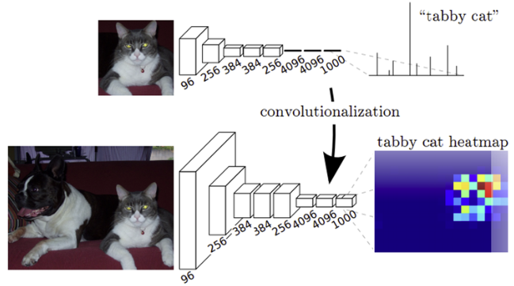

## 1. Fully Convolution Network란?
FCN은 semantic segmentation을 위하여 기존의 CNN 기반 모델을 변형시킨  구조입니다.

## 2. 핵심 아이디어
FCN의 핵심 아이디어는 아래 그림의 아래과 같이 fully connected인 레이어를 1x1 레이어로 대체하는 것입니다.

<small>(출처 : https://m.blog.naver.com/laonple/220958109081)</small>

기존의 CNN은 그림에서 윗부분처럼 컨볼루션을 거친 뒤 펼친 뒤(flat) fully connected를 거쳐 원하는 차원으로 변경합니다. 하지만 이렇게 이 fc 레이어를 거치고 나면 기존의 위치 정보가 모두 사라지게 된다. semantic segmentation을 할 때는 라벨을 구분만 하는 것이 아니라 어느 위치에 있는지까지 파악을 해야하기 때문에 문제가 발생하게 됩니다. 

그래서 FCN에서는 fully connected layer를 1x1 컨볼루션 간주하여 위치 정보를 유지하게 되어 semantic segmentation을 할 수 있습니다.

또한 기존의 CNN으로 semantic segmentation을 할 때 문제점으로 fc layer은 고정된 크기의 입력만을 받아들인다는 문제가 있었습니다. 위에서 언급한 바와 같이 모든 네트워크가 convolutional 네트워크로 구성이 되면 입력 이미지의 크기 제한도 받지 않게 되어 이 문제점도 해결할 수 있습니다.

## 3. Deconvolution
여러 단계의 convolution과 pooling을 거치면 feature map의 크기가 줄어들게 됩니다. 이를 다시 원 이미지의 크기로 복원시키기 위해 backward convolution인 deconvolution을 사용합니다. deconvolution은 컨볼루션을 역으로 적용하는 것입니다.

## 참고 자료
- [# FCN 논문 리뷰 — Fully Convolutional Networks for Semantic Segmentation](https://medium.com/@msmapark2/fcn-%EB%85%BC%EB%AC%B8-%EB%A6%AC%EB%B7%B0-fully-convolutional-networks-for-semantic-segmentation-81f016d76204)
- [3. FCN [1]](https://m.blog.naver.com/laonple/220958109081)