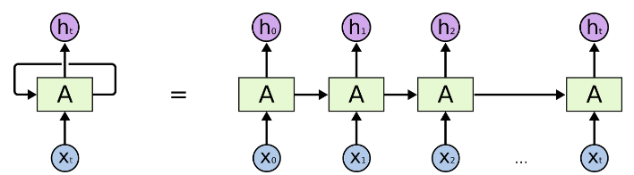

## 1. Recurrent Neural Network(RNN)
RNN은 이전 단계에서 얻은 정보를 지속하기 위한 모델이다. 

위의 그림에서 A가 X를 입력으로 받아 h로 내보내는데, 현재 정보를 다음 단계로 전달하게 됩니다. 이렇게 전달하면 이전의 정보를 기억해야 하는 음성 인식, 번역 등에서 사용되고 있습니다.

하지만 RNN은 멀리 떨어진 과거의 정보를 기억하기 어렵습니다. 가중치와 activation function을 재귀적으로 씌우다보면 gradient가 vanishing 또는 exploding되는 문제가 발생하기 때문입니다.

그래서 이를 해결하여 RNN의 성공의 열쇠가 된 것이 `Long Short Term Memory`입니다.

## 2. Long Short Term Memory(LSTM)
LSTM은 RNN의 한 종류로, 긴 의존 시간(멀리 떨어진 과거) 문제를 피하여 설계되었습니다.

먼저 RNN의 구조입니다. 

위 그림과 같이 neural network 모듈을 반복시키는 구조입니다. RNN은 반복하는 한 모듈이 하나의 layer를 가지고 있습니다.

LSTM은 RNN과 같이 반복 구조를 가지고 있는데, RNN과 달리 한 모듈에 서로 정보를 주고 받는 4개의 layer가 있습니다.

위 모듈 내에서 노란색 박스는 학습된 newral network layer를 나타내고, 분홍색 원은 point-wise operation을 나타냅니다.

## 3. 핵심 아이디어
LSTM의 핵심 아이디어는 cell state입니다. 

cell state는 컨베이어 벨트와 같이 정보를 흐르게 합니다. 정보가 흐를 때 `gate`를 이용해 흐르고 있는 정보를 제어합니다. gate는 sigmoid layer와 pointwise 곱셈으로 이루어져 있습니다. sigmoid layer는 0~1 사이의 값을 내보내고, 값이 0이라면 아무 정보도 넘기지 않고 1이라면 모든 정보를 넘기게 됩니다.

LSTM은 `forget`, `input`, `output` 게이트를 가지고 있습니다.

먼저 forget gate입니다. forget gate는 이름 그대로 어떤 정보를 버릴지 결정하는 게이트입니다. previous hidden state에서 넘어온 정보인 $h_{t-1}$와 input인 $X_{t}$를 받아서 sigmoid 연산을 취합니다. 그러면 0에서 1 사이 값을 얻는데, 이를 previous cell state인 $C_{t-1}$에서 넘어온 정보에 보내줍니다. 만약 값이 0이라면 모든 정보를 버리게 되고, 1이라면 모든 정보를 보존해 cell state에 흐르게 합니다.

다음은 input gate입니다. input gate는 어떤 것을 저장할지를 정합니다. sigmoid layer에서 연산을 취하고, tanh layer가 새로운 후보값 벡터인 $\tilde{C}_{t}$를 만듭니다. 그리고 두 정보를 합칩니다.

이제 $C_{t-1}$를 업데이트해서 $C_{t}$를 만들 것입니다. 먼저 이전 state에 $f_t$를 곱해 버릴 정보들을 버립니다. 그리고 $\tilde{C}_{t} * i_t$를 더해 $C_{t-1}$를 업데이트합니다.

마지막으로 output gate입니다. output gate는 무엇을 출력으로 내보낼지 정하는 게이트입니다. 먼저 input 데이터에서 sigmoid layer를 통해 어떤 부분을 output으로 내보낼지 결정합니다. 그리고 cell state를 tanh layer를 통해 -1에서 1 사이 값을 받은 뒤 sigmoid 값과 곱해줍니다.

## 참고 자료
- [Long Short-Term Memory(LSTM) 이해하기](https://dgkim5360.tistory.com/entry/understanding-long-short-term-memory-lstm-kr)