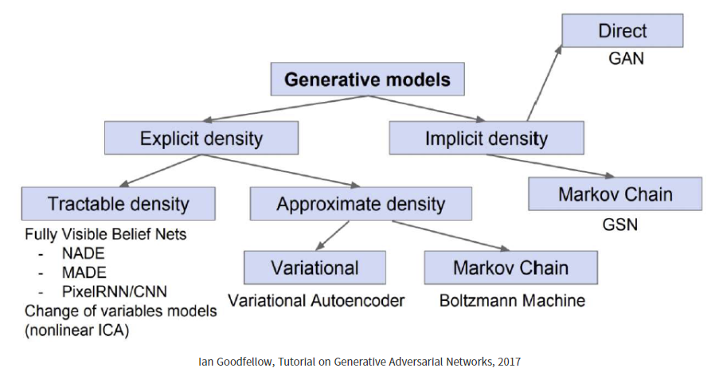

## DL Basic

## 1. 오늘 배운 내용
- Generative model
	- 학습 데이터 분포를 따르는 유사한 데이터를 생성하는 모델
	- 

## 2. Peer Session
- *Special peer session*을 진행하였다.
- [멘토링](https://dear-queen-578.notion.site/3-8ce0706048bb484495624d8d07b9aee0)을 진행하였다.

## 4. 더 공부할 내용
- MLE
- LSTM
- Transformer