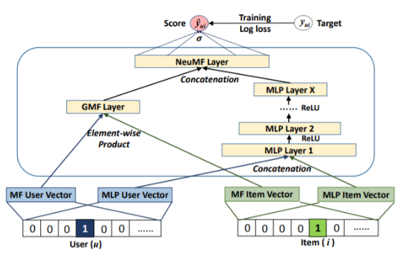

## RecSys 기초 대회

## 1. 오늘 배운 내용
- 프로젝트
	- 베이스라인 코드 분석
		- NCF 모델
			
		- dl_data
			- pandas concat 함수 동작 방식
			- dataFrame map 동작 방식
			- field_dims

## 2. 피어세션
- field_dims에 대해 논의하였다.

## 3. 더 공부할 내용
- MLE
- Transformer
- MF, ALS

## 4. 참고자료
- [[논문 리뷰] Neural Collaborative Filtering](https://leehyejin91.github.io/post-ncf/)