# 랩업리포트

**RecSys 14조**

# Part 1. 프로젝트 Wrap Up

## 1-1. 프로젝트 개요

### 1-1-1. 프로젝트 목표

  대한출판문화협회에 따르면 2021년 대한민국 신간 발행 책은 64,657권이다. 책을 읽기 위해 소요되는 시간과 책을 구매하는 비용 측면에서 구매할 책을 선택하는 것은 중요한 문제이다. 하지만 소비자는 제목, 저자, 표지, 카테고리 등 그 책의 정보와 타 구매자들의 리뷰와 평점만으로 책을 선택해야한다.

 본 대회는 소비자들의 책 구매 결정에 도움을 주기 위해 소비자가 책에 대해 내릴 평점을 예측하는 것을 목표로 한다.

### 1-1-2. 프로젝트 구조

```bash
|📦 code
|    |📂 data
|        |📜 images
|        |📜 train_ratings.csv
|        |📜 test_ratings.csv
|        |📜 books.csv
|        |📜 sample_submission.csv
|        |📜 users.csv
|    |📂 models
|        ****|**📜** FFM.pt
|    |📂 src
|        |📂 data
|            |📜 __init__.py
|            |📜 dl_data.py
|            |📜 context_data.py
|            |📜 image_data.py
|            |📜 text_data.py
|        |📂 ensembles
|            |📜 ensembles.py
|        |📂 models
|            |📜 _models.py
|            |📜 dl_models.py
|            |📜 context_models.py
|            |📜 image_models.py
|            |📜 text_models.py
|        |📜 __init__.py
|        |📜 utils.py
|    |📂 submit
|    |📜 main.py
|    |📜 ensemble.py
```

### 1-1-3. 데이터셋 구조

 주어진 데이터는 `.csv` 형식의 파일로, 사용자(user)과 책(item)의 정보 그리고 사용자(user)가 책(item)에 매긴 평점 데이터이다.

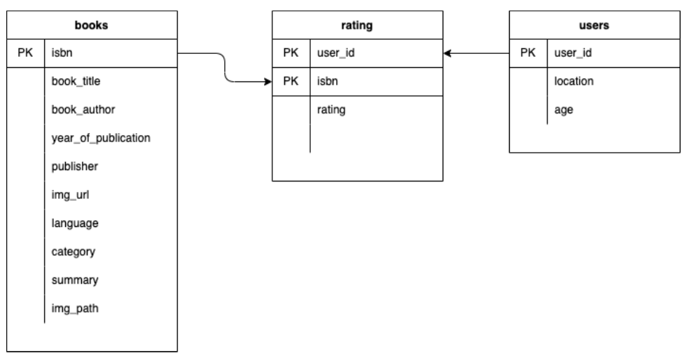

- `users.csv` : 68,092명의 사용자(user)에 대한 정보를 담고 있는 메타데이터이다.
- `books.csv` : 149,570개의 책(item)에 대한 정보를 담고 있는 메타데이터이다.
- `train_ratings.csv` : 59,803명의 사용자(user)가 129,777개의 책(item)에 대해 남긴 306,795건의 평점(rating) 데이터이다.

### 1-1-4. 출력 데이터

 최종 결과물은 주어진 책에 대해 사용자가 매길 것이라고 예상하는 평점을 채워 넣은 `.csv` 형태의 파일로, 아래 `sample_submission.csv` 파일과 같이 출력해야 한다.

| user_id | isbn | rating |
| --- | --- | --- |
| 11676 | 0002005018 | 7.4152054786 |
| 116866 | 0002005018 | 8.3852987289 |
| 152827 | 0060973129 | 8.0158720016 |

### 1-1-5. 협업 도구

**Slack**

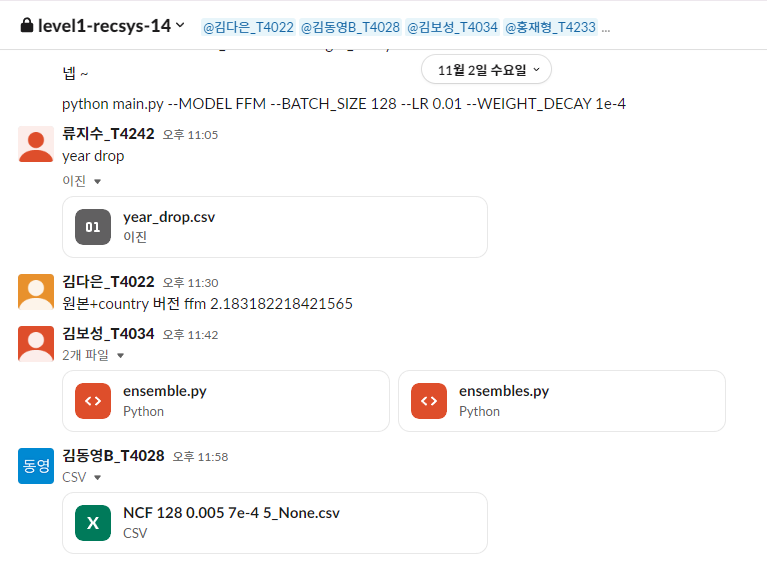

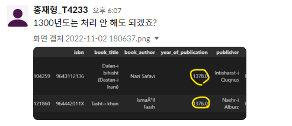

파일 공유, 논의해야할 사항을 Slack을 이용해 공유하였다.

---

**Github**

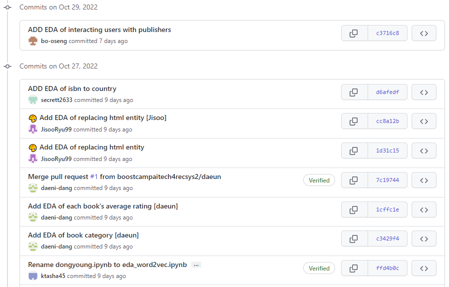

새로운 실험과 버전관리를 위해 Git과 Github를 활용했다.

---

**Vscode Live Share**

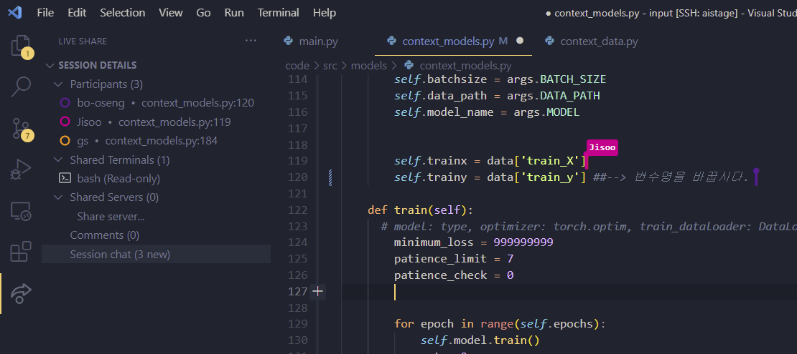

함께 코드를 공유해야할 상황에 vscode의 Live Share을 이용해 동시 작업을 하였다. 이를 통해 빠르고 효율적으로 오류 수정과 공유를 할 수 있었다.

---

**Notion**

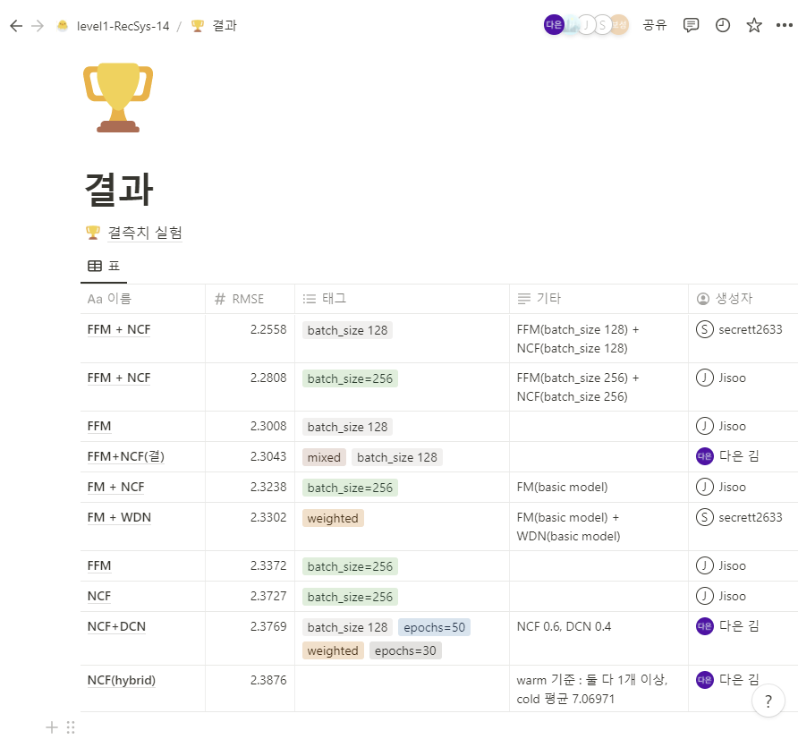

실험결과 Parameter와 RMSE를 쉽고 명확하게 공유하기 위해 노션을 활용했다.      

## 1-2. 프로젝트 팀 구성 및 역할

 대회의 처음부터 끝까지 모든 역할을 직접 경험 해보고 싶다는 의견이 많았다. 때문에 본 대회에서는 역할을 나누지 않고 `EDA` → `Feature Engineering` → `Model` → `Hyper Parameter Tunning` 의 과정을 다 같이 시행했다.

- 류지수(팀장) : FM, FFM 모델 연구 및 실험, EDA(결측치 보완), 하이퍼파라미터 튜닝 자동화
- 김다은(팀원) : NCF 모델 연구 및 실험, FFM 모델에 k-fold 적용.
- 김동영(팀원) : deepconn 모델 고도화. deepconn+FFM 모델 개발. 하이퍼파라미터 튜닝 자동화.
- 김보성(팀원) : Hybird Model(NCF + FFM) 실험, Custom Ensemble(Warm + Cold) 실험, lightFM 라이브러리 모델 연구 및 실험.
- 홍재형(팀원) : CNN_FM 연구 및 실험, EDA(결측치 보완)

## 1-3. 프로젝트 수행 절차 및 방법

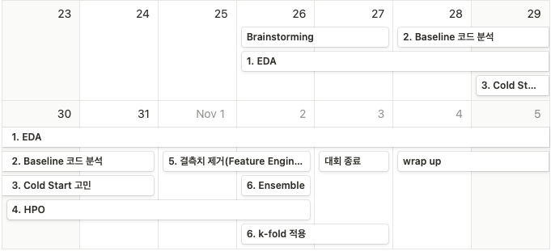

1. 학습 데이터 EDA, summary와 title 전처리
2. 팀원들이 baseline에서 각각 1개의 모델을 맡아 데이터의 흐름과 연산 과정을 점검
3. cold start 문제 해결 방법을 찾아보고, cold start에 강한 모델들을 tuning
4. feature 결측치 채우기
5. k-fold와 앙상블을 통해 성능 높이기

## 1-4. 프로젝트 수행 결과

**FFM에 K-Fold validation을 적용한 모델을 선택하였다.**

### 1-4-1. 데이터 분석 및 전처리

**User**

user_id

- user_id는 68,092개 모두 중복이 없다.

locaton

- location은 city, state, country 순으로 이루어진 문자열 데이터이며 결측치는 `n/a` 문자열로 채워져있어 전처리가 필요하다.
- location 정보를 city, state, country로 각각 분류하였다.
- city, state, country 각각에 존재하는 `n/a` 값은 문자열 ‘na’로 채웠다.

age

- age는 약 40%가 결측치가 존재했다.
- age의 결측치는 전체 user의 평균으로 채웠다.

**Book**

isbn

- 149,570개 모두 중복이 없다.

book_title

- 14,134개의 같은 이름의 책이 관측되었다.

book_author

- `P.J. O'Rourke`와 `P. J. O'Rourke`와 같이 동일 저자이나 공백과 대소문자로 인해 다른 저자로 분류되었다.
- book_author을 모두 소문자로 바꾼 뒤 공백을 제거하여 같은 저자인데 대소문자와 공백으로 인해 다른 저자로 분류되지 않도록 하였다.

year of publication

- 가장 낮은 데이터는 1376이다. 또한 1960년 이후의 출판된 책의 분포는 다음과 같다.
    
    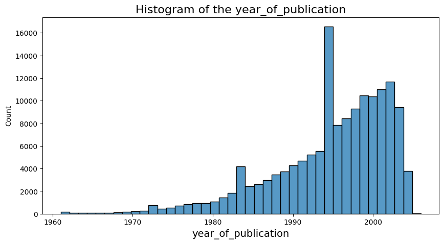
    

publisher

- publisher 데이터 중 `Penguin USA (Paper)`, `Penguin USA`와 같은 표기 방법의 차이 및 오타로 인해 같은 그룹으로 묶이지 못한 데이터가 관측되었다.
- isbn의 publisher 고유번호를 기준으로 publisher를 1507개서 534개로 더 명확하게 그룹화했다.

img_url

- isbn의 데이터가 포함되어 있음이 관측되었다.
- img_url과 isbn의 일치 여부를 관측했고 모두 일치하였다.

summary

- 약 45%의 결측치가 존재하였다.
- `&#39;`와 같은 HTML 엔티티 데이터가 관측되었다.
- 관측된 HTML 엔티티를 원래의 문자로 대체하였다.
- 결측치는 book_title로 채웠다.
- 개행을 전부 없애고 lowercase로 변경했다.

language

- 약 45%의 결측치가 존재했다.
- 95%는 `en`이다. 또한 상위 5개의 language의 합이 98% 이상이다.
    
    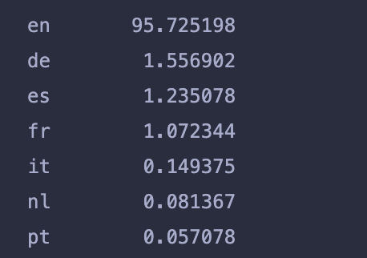
    
- isbn의 처음 1~5자리 숫자가 국가코드인 것을 이용해 country 항목을 생성하여 채웠다.
- 결측값은 다른 책의 같은 book_author과 매핑시켜 결측값을 채웠다.
- country에서 `English`가 89.8%를 차지하였으므로 country가 `English`인 책은 1로, 아닌 책은 0으로 채웠다.
    
    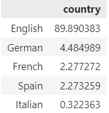
    

category

- 약 46%의 결측치가 존재했다.
- `1940-1049`와 같은 이상 데이터가 관측되었다.
- `history fiction`, `science fiction`과 같이 애매한 분류가 있었고, 카테고리의 개수가 지나치게 많았다.
- 유사한 카테고리를 묶어 카테고리의 수를 줄였다.
- `fiction` 카테고리가 50% 이상을 차지하였으므로 category의 결측치를 `fiction`으로 채웠다.

img_path

- img_path 데이터의 형식에 isbn의 데이터가 포함되어 있음이 관측되었다.
- img_path와 isbn의 일치 여부를 관측했고 모두 일치하였다.

**Ratings**

- 68,092명의 User와 149,570권의 Books의 Interection 중 관측된 정보는 306,795건으로 99.9%의 Sparse Matrix의 데이터가 주어졌다.
- Ratings의 분포는 다음과 같았다.
    
    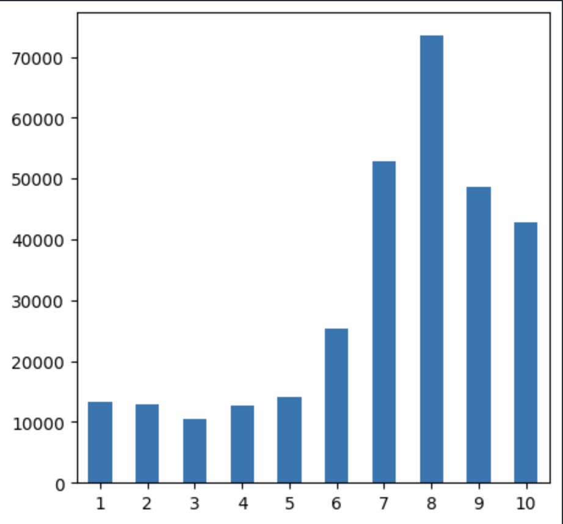
    

**Model Select**

- baseline 모델 중 cold start에 강한 모델인 ffm과 deepconn 을 선정했다.

### **1-4-2. 모델 개선**

- baseline에는 없는 earlystopping 기능을 추가하고, 보다 정확한 실험을 위해 rmse 도출 코드를 수정했다.
- shell script와 tensorboard를 이용해서 최적의 hyper-parameter을 찾고 학습시켰다.
- 10-fold validation을 목표로 모델을 학습 했으나 시간이 부족하여 4-fold vaildation의 결과를 제출하였다.

### 1-4-3. 최종 결과

**Model** : `FFM`

**Hyper-Parameter** : `batch_size 256` `learning_rate 0.01` `weight_decay 1e-4` `epochs 10`

10-fold (4번 fold에서 멈춤)

- CV score (valid) : RMSE 2.1758
- LB score (Public) : RMSE 2.1414
- LB score (Private) : RMSE 2.1418

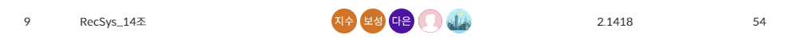

## 1-5. 자체 평가 의견

**잘했던 점**

- 팀원 전체가 모든 과정에 참여한 점
- 베이스라인 모델을 나눠서 살펴본 점
- 나온 결과를 보고 토론한 점
- 다양한 시도를 해본 점
- 계속 같이하면서 하고 있는 것을 공유한 점

---

**시도 했으나 잘 되지 않았던 것들**

- 결측치 채우기
- cold start 문제 해결
- 이미지 기반 모델
- lightFM 모델

---

**아쉬웠던 점들**

- 목표를 구체적으로 정하지 않고 파트를 나누지 않은 점
- 생각만 하고 끝까지 도전하지 않은 점
- kaggle을 찾아보면서 방향을 빨리 잡지 못한 점
- 마스터클래스에서 소개했던 내용을 하지 않은 점
- 다른 평가 지표를 써보지 않은 점
- 다른 optimizer를 써보지 않은 점

---

**프로젝트를 통해 배운 점 또는 시사점**

 본 대회의 데이터는 범주형 데이터가 많았다. 상위권 팀들은 공통적으로 범주형 데이터를 잘 처리한다고 알려진 Catboost 모델을 활용했다. 반면 우리 팀은 Catboost 모델에 대한 사전 지식이 부족했다.

 모델의 구체적인 구조에 대한 깊은 이해도 중요하지만 엔지니어로서 문제 해결을 위해 각 모델들이 어떤 문제를 해결하고자 발전했는지, 어떤 특성의 데이터를 잘 처리하는지, 어떤 한계점이 있는지 특성들에 대해 체계를 잡아야 함을 배웠다.

### [참조]

- [http://member.kpa21.or.kr/kpa_bbs/2021년-출판통계/](http://member.kpa21.or.kr/kpa_bbs/2021%eb%85%84-%ec%b6%9c%ed%8c%90%ed%86%b5%ea%b3%84/)