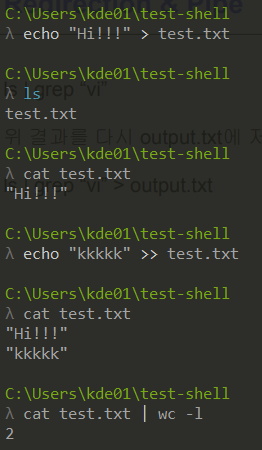

## AI 서비스 개발 기초

## 1. 오늘 배운 내용
### 쉘
쉘이란 사용자가 문자를 입력해 컴퓨터에 명령할 수 있도록 하는 프로그램이다. 쉘 종류로는 `sh`, `bash`, `zsh`가 있다.

#### 쉘 커맨드
`pwd` : Print Working Directory로, 현재 폴더의 절대 경로를 보여준다.
`echo` : print와 같은 역할. echo \`쉘 커맨드\`로 입력하면 쉘 커맨드의 결과를 출력한다. (ex. echo \`pwd\`)
`cat` : 여러 파일을 인자로 주면 concat해서 출력한다. `>`를 이용해 overwrite할 수 있다. `>>`를 이용해 append할 수 있다.
`history` : 최근에 입력한 쉘 커맨드의 history를 출력한다.
`head`, `tail` : 파일의 앞/뒤 n개의 행을 출력한다. (ex. `head -n 3 vi-test.sh`)
`sort` : 행 단위로 정렬한다. `-r`은 내림차순으로 정렬하는 옵션이고, `-n`은 numeric sort 옵션이다. (ex. `cat fruits.txt | sort`)
`uniq` : 중복된 행을 제거한다. (ex. `cat fruits.txt | uniq`)
`grep` : 파일에서 패턴 목록과 매칭되는 라인을 검색한다.
`cut` : 파일에서 특정 필드를 추출한다. (ex. `cat cut_file | cur -d : -f 1,7`)
`>` : redirection. overwrite. 파일이 없으면 생성하고 저장한다. (ex. `echo "hi" > vi-text3.sh`)
`>>` : redirection. append. 파일의 맨 아래에 추가한다. (ex. `echo 'hi' >> vi-text3.sh`)
`ps` : Process Status. 현재 실행되고 있는 프로세스를 출력한다.
`curl` : Client URL. Request를 테스트한다.
`df` : Disk Free. 현재 사용 중인 디스크이 용량을 확인한다. `-h` 옵션을 주면 읽기 쉬운 형태로 출력할 수 있다.
`scp` : Secure CoPy. SSH를 이용해 호스트 간 파일을 주고받는 명령어이다.
`nohup` : 터미널이 종료되더라도 작업이 계속 유지되도록 한다. (ex. `nohup python3 app.py &`)

#### Redirection & Pipe 연습 문제
1. text.txt 파일에 "Hi!!!"를 입력해주세요.
```bash
echo "Hi!!!" > test.txt
```
2. test.txt 파일 맨 아래에 "kkkkk"를 입력해주세요.
```bash
echo "kkkkk" >> test.txt
```
3. test.txt의 라인 수를 구해주세요.
```bash
cat test.txt | wc -l
```
[실습 결과]


### Special Mision
- 카카오톡 그룹 채팅방에서 옵션 - 대화 내보내기로 csv로 저장 후, 쉘 커맨드 1줄로 카카오톡 대화방에서 2021년에 제일 메세지를 많이 보낸 TOP 3명 추출하기!

## 2. 더 공부할 내용
- MLE
- Transformer
- MF, ALS