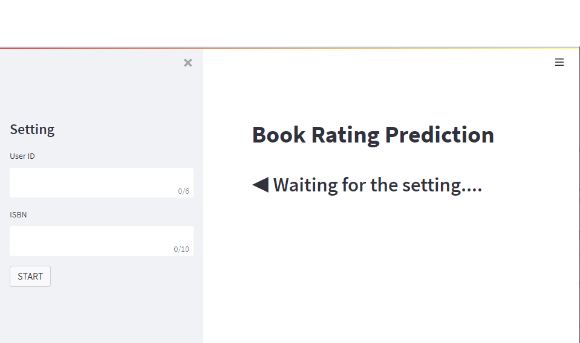
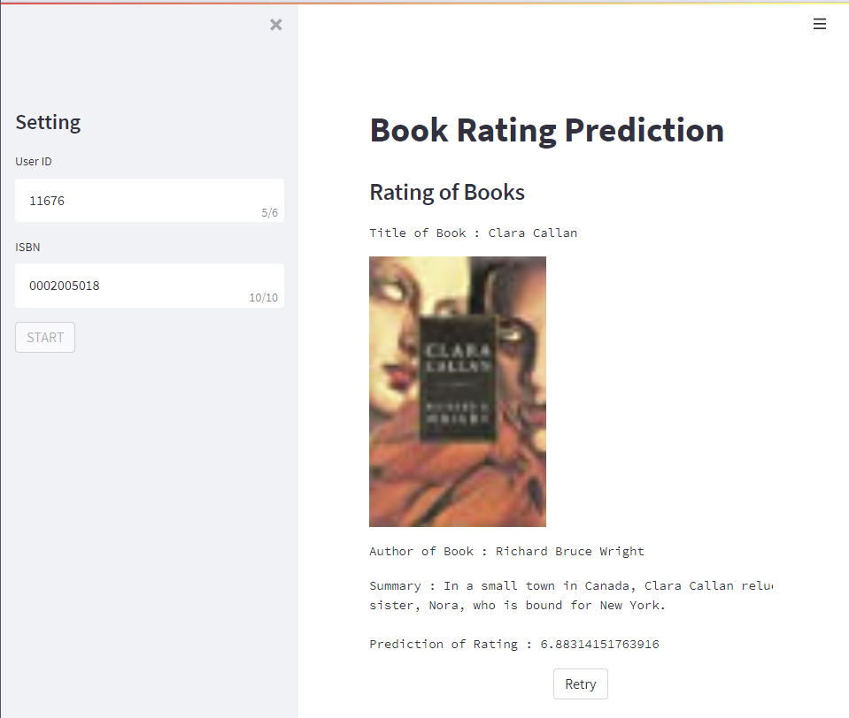
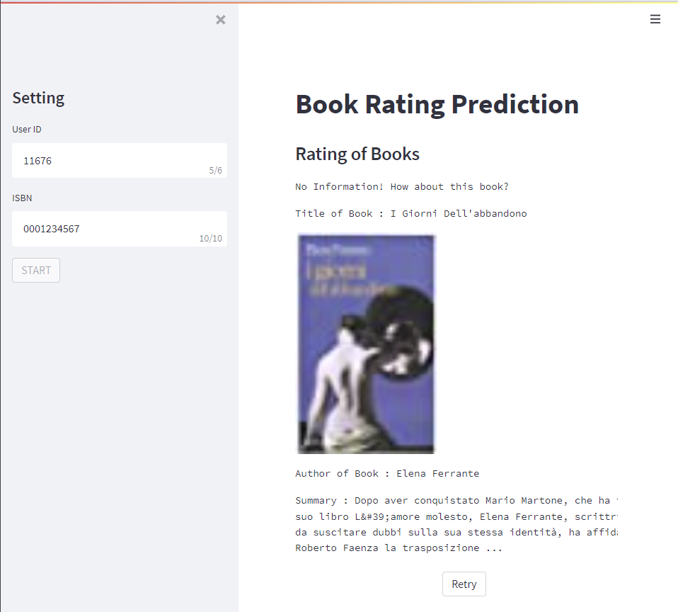

## AI 서비스 개발 기초

## 1. 오늘 배운 내용
### Docker 개념
가상화는 local 환경과 production 서버 환경의 차이 때문에 필요하다. 라이브러리 등을 설치할 때 OS마다 다르게 진행해야 하고, 서버에서 올바르게 작동하지 않을 수 있기 때문이다.
가상화는 Research 환경과 Production 환경에서 공통적으로 사용하는 일종의 템플릿이라고 할 수 있다.

도커는 container 기술을 사용할 수 있도록 나온 도구이다. 
**Docker Image** : 컨테이너를 실행할 때 사용할 수 있는 템플릿
**Docker Container** : docker image를 활용해 실행된 인스턴스
도커를 이용하면 다른 사람이 만든 소프트웨어를 가져와 사용할 수 있다. 이렇게 다른 사람이 만든 소프트웨어를 **Docker Image**라고 한다. 이 도커 이미지는 어느 OS에서나 동일하게 실행할 수 있다.


### Docker 실습
`docker pull "이미지 이름:태그"` : 이미지를 다운 받는다.
`docker images` : 다운받은 이미지를 확인한다.
`docker run "이미지 이름:태그"` : docker container를 만들고 실행한다.
`docker ps` : 실행한 컨테이너를 확인한다. 작동을 멈춘 컨테이너는 `-a` 옵션을 통해 확인할 수 있다.
`docker exec -it "컨테이너 이름" /bin/bash` : 해당 컨테이너에 진입한다.
`docker stop "컨테이너 이름"` : 컨테이너의 실행을 중지한다.
`docker rm "컨테이너 이름"` : 작동을 멈춘 컨테이너를 삭제한다. 실행중인 컨테이너를 삭제하려면 `-f` 옵션을 준다.

## 2. 과제 수행
대회에서 진행하였던 책 평점 예측을 streamlit을 이용해 웹 서비스로 만들어보았다. 
대회에서는 유저의 id와 책의 isbn을 가지고 평점을 예측했는데, 이것을 웹으로 어떻게 구현할지 고민하다가 현재 단계에서는 웹 서비스에 올려보는 것이 목적이라 생각하여 어렵지 않게 접근하였다.

접근 방식은 사용자에게 user id와 isbn을 입력받은 뒤, 이를 하나의 튜플로 만들어 딕셔너리에서 키 값으로 찾는 것이었다. 즉, 예측 결과들이 담긴 딕셔너리가 {(user_id, isbn) : rating, (user_id, isbn) : rating, ...} 과 같은 형식으로 있으면, 입력받은 튜플을 키 값 조회하여 rating을 뽑아내는 간단한 방식이었다.


초기 화면은 아래와 같다.
[초기 화면]

먼저 왼쪽 sidebar에 user id와 isbn을 입력받았다. 여기에서 user id는 최대 6글자가 올 수 있고, isbn은 모두 10자리로 고정되어있다. 그래서 10자리 이하로 입력되지 않도록 하고 싶었으나 메소드를 찾지 못해서, 최대 자릿수로 설정하였다. 이렇게 하면 입력 칸 오른쪽에 자릿수가 찍혀 보기 좋았다. 
sidebar 아래의 START 버튼을 누르면 아래 그림과 같이 나온다.

[결과 화면 - 예측 가능]

입력된 user id와 isbn에 대응하는 예측된 평점을 출력하는 것이 목표였다.
하지만 평점만 출력하는 것은 웹 서비스에 적합하지 않으므로, 조금 더 웹스럽게 만들어보고자 책의 제목과 책 이미지, 저자, 요약을 추가한 뒤 예측된 평점을 출력해보았다.

만약 입력된 user_id와 isbn이 존재하지 않아 예측이 불가한 상황도 구현해보았다. 아래 그림과 같다.

[결과 화면 - 예측 불가능]

만약 입력된 user id와 isbn 중 하나라도 cold start라면 무작위로 추천해보았다. books.csv 파일에서 랜덤하게 한 권을 뽑아 책의 정보를 출력하였다.

이렇게 웹으로 바꾸기 위해 한 작업은 다음과 같다.
1. 대회에서 사용한 context_data.py의 내용을 가지고 와 data load, data split, dataloader를 사용하였다.
2. 모델의 경우에는 FFM과 관련된 부분을 가지고 왔다. 여기에서 바꾼 점은 predict 함수를 수정하였는데, 현재의 방식으로는 predict에서 반환되는 예측 결과들이 {(user_id, isbn) : rating} 형태로 이루어진 딕셔너리여야 했다. 따라서 이 부분을 딕셔너리로 반환하도록 수정해주었다.
```python
def predict(self, dataloader, idx2user, idx2isbn):
  self.model.eval()
  self.model.load_state_dict(torch.l('models/FFM.pt', map_location=tordevice('cpu')))
  predicts = dict()
  with torch.no_grad():
      for fields in dataloader:
          fields = fields[0].to(self.device)
          y = self.model(fields)
          y_idx = 0
          for f in fields:
              user_id = idx2user[f[0].i()]
              isbn = idx2isbn[f[1].item()]
              predicts[(user_id, isbn)] [y_idx].item()
              y_idx += 1
  return predicts
```
3. main에서는 먼저 sidebar에서 입력받은 user_id와 isbn을 튜플로 session_state에 저장해주었다. 그리고 st.container을 이용해 이 튜플이 predict 딕셔너리에 존재하면 책의 정보와 rating을 출력해주었고, 존재하지 않는다면 랜덤하게 책 하나를 뽑아 출력해주었다.


## 3. 피어세션
- streamlit 과제 코드를 리뷰하였다.


## 4. 더 공부할 내용
- MLE
- Transformer
- MF, ALS