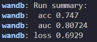
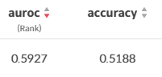

## DKT

## 1. 오늘 배운 내용
#### 데이터 파악
마스터클래스를 들으며 알게 된 내용을 정리하였다.
어제는 날짜 및 시간 정보가 크게 의미가 없을 것이라고 생각했는데 마클을 들으며 생각해보니 중요한 정보였다. 간단히 생각해서는 유저가 한 문제를 푼 시간을 알 수 있다. 이를 통해 문제를 풀기 위해 걸린 시간을 알 수 있고, 오래 걸릴수록 어려울 것이라는 생각을 할 수 있다. 
또한, 날짜 정보도 이용할 수 있을 것 같다. 같은 날 틀렸던 문제와 같은 유형의 문제를 또 만난다면 틀릴 확률이 높을 것이고, 일주일 후에 만난다면 맞출 확률이 높아질 것이다. 

pretrained 모델을 사용하는 것도 방법일 것 같은데, 어떻게 사용해볼지는 추후에 고민해볼 예정이다.

## 대회
dkt 베이스라인을 돌렸을 때 결과값이 음수가 나왔다. 왜?
lightgcn 베이스라인을 돌렸을 때 찍히는 AUC와 실제 LB에 찍히는 AUC가 크게 차이가 났다.
[train.py 돌렸을 때]

[LB]

이유를 찾아야 할 것 같다.

## 2. 피어세션
- 앙상블을 할 때 AUC를 구하는 방법에 대해 논의하였다.

## 3. 멘토링
- 첫 멘토링이기에 각자 소개하고 미래 방향에 대해 이야기 나누었다.
- 멘토링 진행 방향에 대해 이야기 나누었다.